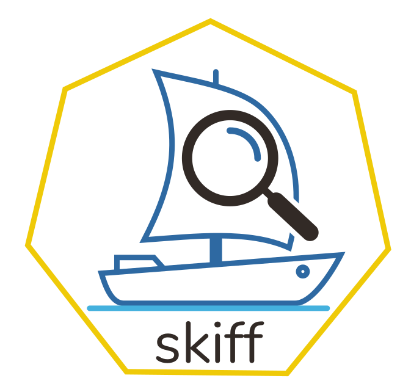

<div align="center">
  
</div>

# skiff - OCI image analysis utility

A simple OCI image analysis utility, helping you uncover what consumes so much disk space in your container images.

## Installation

### From Source
```bash
git clone https://github.com/dcermak/skiff
cd skiff
make binaries
```

## Usage

### `skiff layers`

Print the size of each layer in an image.

**Usage:**
```bash
$ skiff layers registry.suse.com/bci/python@sha256:677b52cc1d587ff72430f1b607343a3d1f88b15a9bbd999601554ff303d6774f
sha256:abb83fe2605d91490ec6d6812c2fec309feb463e4359f8f971428bb560c38af1 47480531 378c0b02df2b31ed2e39d2e7026571287f1c57f4ecfd631a285381eeb0e7894c 129486336
sha256:dbdff6b3e29778a160277784fbcfc864cf1e0c6df77edbac2bafb777c16b77b6 46534194 4672d0cba723f1a9a7b91c1e06f5d8801a076b1bdf4990806cdaabcd53992738 125604864
```

### `skiff top`

Analyze a container image and list files by size (top 10 largest files).

```
$ skiff top registry.suse.com/bci/python@sha256:677b52cc1d587ff72430f1b607343a3d1f88b15a9bbd999601554ff303d6774f
FILE PATH                          SIZE     DIFF ID
/usr/bin/container-suseconnect     9245304  4672d0cba723
/usr/lib64/libzypp.so.1735.1.1     8767504  4672d0cba723
/usr/lib/sysimage/rpm/Packages.db  7837536  88304527ded0
/usr/lib64/libpython3.11.so.1.0    5876440  88304527ded0
/usr/lib64/libcrypto.so.3.1.4      5715672  4672d0cba723
/usr/lib/sysimage/rpm/Packages.db  5190128  4672d0cba723
/usr/share/misc/magic.mgc          4983184  4672d0cba723
/usr/lib/git/git                   3726520  88304527ded0
/usr/lib/locale/locale-archive     3058640  4672d0cba723
/usr/bin/zypper                    2915456  4672d0cba723
```

## Use Cases

- Image Optimization - Identify large files and unnecessary layers to reduce image size
- Layer Debugging - Understand what each layer contributes to the final image

## Contributing

Contributions are welcome! Please feel free to submit issues and pull requests.
